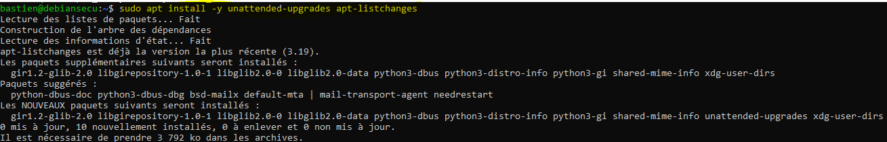
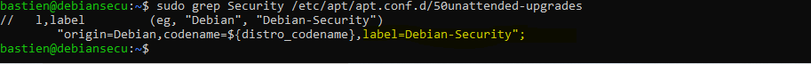
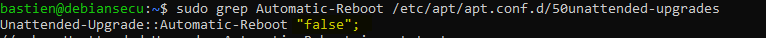
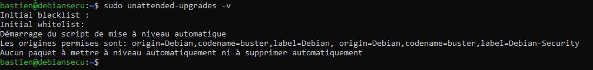

# Applications des correctifs

Nous allons mettre en place un mécanismes pour automatiser les mises à jour de sécurité sur notre système Linux. Pour cela, nous allons utiliser l'outil _unattended-upgrades_.

## Classification

* Niveau ANSSI : intermédiaire
* Mises à jour
* Patchs de sécurité
* Automatisation

## Sources

* [ANSSI](https://www.ssi.gouv.fr/uploads/2016/01/linux_configuration-fr-v1.2.pdf)

* [unattended-upgrades](https://www.kanjian.fr/automatiser-mises-a-jour-de-serveur-debian.html#.YGGZxa8zaUl)

## Procédures

### Installation

### Configuration

### PoC

## Commentaires