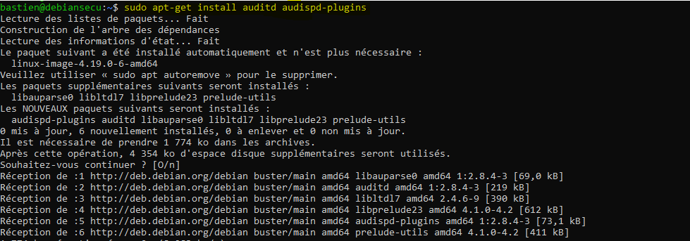
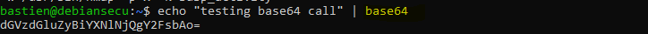
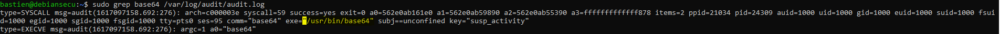

# Auditd

## Classification

* Niveau ANSSI : renforcé
* Audit
* Journalisation
* Moindre privilèges

## Sources

* [ANSSI](https://www.ssi.gouv.fr/uploads/2016/01/linux_configuration-fr-v1.2.pdf)
* [Neo23x0](https://github.com/Neo23x0/auditd)
* [highon.coffee](https://highon.coffee/blog/security-harden-centos-7/#auditd---audit-daemon)
* [linux-audit](https://github.com/linux-audit/audit-userspace/tree/master/rules)
* [connect.ed-diamond.com](https://connect.ed-diamond.com/GNU-Linux-Magazine/GLMFHS-093/Journalisez-les-actions-de-vos-utilisateurs-avec-Auditd)
* [linux-audit.com](https://linux-audit.com/configuring-and-auditing-linux-systems-with-audit-daemon/)

## Procédures

Installons les paquets nécessaires au bon fonctionnement d'auditd :

Définissons ensuite les règles d'audit dans le /etc/auditd/audit.rules:

    ## First rule - delete all
    -D

    ## Increase the buffers to survive stress events.
    ## Make this bigger for busy systems
    -b 8192

    ## This determine how long to wait in burst of events
    --backlog_wait_time 0

    ## Set failure mode to syslog
    -f 1

    # Ignore errors
    # ## e.g. caused by users or files not found in the local environment
    -i

    ################################## SELF AUDITING ##################################
    ### Successful and unsuccessful attempts to read information from the audit records
    -w /var/log/audit/ -k auditlog

    ### Auditd configuration
    #### Modifications to audit configuration that occur while the audit collection functions are operating
    -w /etc/audit/ -p wa -k auditconfig
    -w /etc/libaudit.conf -p wa -k auditconfig
    -w /etc/audisp/ -p wa -k audispconfig

    ### Monitor for use of audit management tools
    -w /sbin/auditctl -p x -k audittools
    -w /sbin/auditd -p x -k audittools
    -w /usr/sbin/augenrules -p x -k audittools

    ################################### RULES ##################################
    ## Kernel parameters
    -w /etc/sysctl.conf -p wa -k sysctl
    -w /etc/sysctl.d -p wa -k sysctl

    ### Kernel module loading and unloading
    -a always,exit -F perm=x -F auid!=-1 -F path=/sbin/insmod -k modules
    -a always,exit -F perm=x -F auid!=-1 -F path=/sbin/modprobe -k modules
    -a always,exit -F perm=x -F auid!=-1 -F path=/sbin/rmmod -k modules
    -a always,exit -F arch=b64 -S finit_module -S init_module -S delete_module -F auid!=-1 -k modules
    -a always,exit -F arch=b32 -S finit_module -S init_module -S delete_module -F auid!=-1 -k modules

    ### Modprobe configuration
    -w /etc/modprobe.conf -p wa -k modprobe
    -w /etc/modprobe.d -p wa -k modprobe

    ### KExec usage (all actions)
    -a always,exit -F arch=b64 -S kexec_load -k KEXEC
    -a always,exit -F arch=b32 -S sys_kexec_load -k KEXEC

    ### Special files
    -a always,exit -F arch=b32 -S mknod -S mknodat -k specialfiles
    -a always,exit -F arch=b64 -S mknod -S mknodat -k specialfiles

    ### Mount operations (only attributable)
    -a always,exit -F arch=b64 -S mount -S umount2 -F auid!=-1 -k mount
    -a always,exit -F arch=b32 -S mount -S umount -S umount2 -F auid!=-1 -k mount

    ## Change swap (only attributable)
    -a always,exit -F arch=b64 -S swapon -S swapoff -F auid!=-1 -k swap
    -a always,exit -F arch=b32 -S swapon -S swapoff -F auid!=-1 -k swap

    ### Time
    -a always,exit -F arch=b32 -S adjtimex -S settimeofday -S clock_settime -k time
    -a always,exit -F arch=b64 -S adjtimex -S settimeofday -S clock_settime -k time

    #### Local time zone
    -w /etc/localtime -p wa -k localtime

    ### Stunnel
    -w /usr/sbin/stunnel -p x -k stunnel
    -w /usr/bin/stunnel -p x -k stunnel

    ### Cron configuration & scheduled jobs
    -w /etc/cron.allow -p wa -k cron
    -w /etc/cron.deny -p wa -k cron
    -w /etc/cron.d/ -p wa -k cron
    -w /etc/cron.daily/ -p wa -k cron
    -w /etc/cron.hourly/ -p wa -k cron
    -w /etc/cron.monthly/ -p wa -k cron
    -w /etc/cron.weekly/ -p wa -k cron
    -w /etc/crontab -p wa -k cron
    -w /var/spool/cron/ -k cron

    ### User, group, password databases
    -w /etc/group -p wa -k etcgroup
    -w /etc/passwd -p wa -k etcpasswd
    -w /etc/gshadow -k etcgroup
    -w /etc/shadow -k etcpasswd
    -w /etc/security/opasswd -k opasswd

    ### Sudoers file changes
    -w /etc/sudoers -p wa -k actions
    -w /etc/sudoers.d/ -p wa -k actions

    ### Passwd
    -w /usr/bin/passwd -p x -k passwd_modification

    ### Tools to change group identifiers
    -w /usr/sbin/groupadd -p x -k group_modification
    -w /usr/sbin/groupmod -p x -k group_modification
    -w /usr/sbin/addgroup -p x -k group_modification
    -w /usr/sbin/useradd -p x -k user_modification
    -w /usr/sbin/userdel -p x -k user_modification
    -w /usr/sbin/usermod -p x -k user_modification
    -w /usr/sbin/adduser -p x -k user_modification

    ### Login configuration and information
    -w /etc/login.defs -p wa -k login
    -w /etc/securetty -p wa -k login
    -w /var/log/faillog -p wa -k login
    -w /var/log/lastlog -p wa -k login
    -w /var/log/tallylog -p wa -k login

    ### Network Environment
    #### Changes to hostname
    -a always,exit -F arch=b32 -S sethostname -S setdomainname -k network_modifications
    -a always,exit -F arch=b64 -S sethostname -S setdomainname -k network_modifications

    ### Successful IPv4 Connections
    -a always,exit -F arch=b64 -S connect -F a2=16 -F success=1 -F key=network_connect_4
    -a always,exit -F arch=b32 -S connect -F a2=16 -F success=1 -F key=network_connect_4

    ### Successful IPv6 Connections
    -a always,exit -F arch=b64 -S connect -F a2=28 -F success=1 -F key=network_connect_6
    -a always,exit -F arch=b32 -S connect -F a2=28 -F success=1 -F key=network_connect_6

    #### Changes to other files
    -w /etc/hosts -p wa -k network_modifications
    -w /etc/sysconfig/network -p wa -k network_modifications
    -w /etc/sysconfig/network-scripts -p w -k network_modifications
    -w /etc/network/ -p wa -k network
    -a always,exit -F dir=/etc/NetworkManager/ -F perm=wa -k network_modifications

    #### Changes to issue
    -w /etc/issue -p wa -k etcissue
    -w /etc/issue.net -p wa -k etcissue

    ### System startup scripts
    -w /etc/inittab -p wa -k init
    -w /etc/init.d/ -p wa -k init
    -w /etc/init/ -p wa -k init

    ### Library search paths
    -w /etc/ld.so.conf -p wa -k libpath
    -w /etc/ld.so.conf.d -p wa -k libpath

    ### Systemwide library preloads (LD_PRELOAD)
    -w /etc/ld.so.preload -p wa -k systemwide_preloads

    ### Pam configuration
    -w /etc/pam.d/ -p wa -k pam
    -w /etc/security/limits.conf -p wa  -k pam
    -w /etc/security/limits.d -p wa  -k pam
    -w /etc/security/pam_env.conf -p wa -k pam
    -w /etc/security/namespace.conf -p wa -k pam
    -w /etc/security/namespace.d -p wa -k pam
    -w /etc/security/namespace.init -p wa -k pam

    ### Mail configuration
    -w /etc/aliases -p wa -k mail
    -w /etc/postfix/ -p wa -k mail
    -w /etc/exim4/ -p wa -k mail

    ### SSH configuration
    -w /etc/ssh/sshd_config -k sshd
    -w /etc/ssh/sshd_config.d -k sshd

    ### root ssh key tampering
    -w /root/.ssh -p wa -k rootkey

    ## Systemd
    -w /bin/systemctl -p x -k systemd
    -w /etc/systemd/ -p wa -k systemd

    ### SELinux events that modify the system's Mandatory Access Controls (MAC)
    -w /etc/selinux/ -p wa -k mac_policy

    ### Critical elements access failures
    -a always,exit -F arch=b64 -S open -F dir=/etc -F success=0 -k unauthedfileaccess
    -a always,exit -F arch=b64 -S open -F dir=/bin -F success=0 -k unauthedfileaccess
    -a always,exit -F arch=b64 -S open -F dir=/sbin -F success=0 -k unauthedfileaccess
    -a always,exit -F arch=b64 -S open -F dir=/usr/bin -F success=0 -k unauthedfileaccess
    -a always,exit -F arch=b64 -S open -F dir=/usr/sbin -F success=0 -k unauthedfileaccess
    -a always,exit -F arch=b64 -S open -F dir=/var -F success=0 -k unauthedfileaccess
    -a always,exit -F arch=b64 -S open -F dir=/home -F success=0 -k unauthedfileaccess
    -a always,exit -F arch=b64 -S open -F dir=/srv -F success=0 -k unauthedfileaccess

    ### Process ID change (switching accounts) applications
    -w /bin/su -p x -k priv_esc
    -w /usr/bin/sudo -p x -k priv_esc
    -w /etc/sudoers -p rw -k priv_esc
    -w /etc/sudoers.d -p rw -k priv_esc

    ### Power state
    -w /sbin/shutdown -p x -k power
    -w /sbin/poweroff -p x -k power
    -w /sbin/reboot -p x -k power
    -w /sbin/halt -p x -k power

    ### Session initiation information
    -w /var/run/utmp -p wa -k session
    -w /var/log/btmp -p wa -k session
    -w /var/log/wtmp -p wa -k session

    ### Discretionary Access Control (DAC) modifications
    -a always,exit -F arch=b32 -S chmod -F auid>=1000 -F auid!=-1 -k perm_mod
    -a always,exit -F arch=b32 -S chown -F auid>=1000 -F auid!=-1 -k perm_mod
    -a always,exit -F arch=b32 -S fchmod -F auid>=1000 -F auid!=-1 -k perm_mod
    -a always,exit -F arch=b32 -S fchmodat -F auid>=1000 -F auid!=-1 -k perm_mod
    -a always,exit -F arch=b32 -S fchown -F auid>=1000 -F auid!=-1 -k perm_mod
    -a always,exit -F arch=b32 -S fchownat -F auid>=1000 -F auid!=-1 -k perm_mod
    -a always,exit -F arch=b32 -S fremovexattr -F auid>=1000 -F auid!=-1 -k perm_mod
    -a always,exit -F arch=b32 -S fsetxattr -F auid>=1000 -F auid!=-1 -k perm_mod
    -a always,exit -F arch=b32 -S lchown -F auid>=1000 -F auid!=-1 -k perm_mod
    -a always,exit -F arch=b32 -S lremovexattr -F auid>=1000 -F auid!=-1 -k perm_mod
    -a always,exit -F arch=b32 -S lsetxattr -F auid>=1000 -F auid!=-1 -k perm_mod
    -a always,exit -F arch=b32 -S removexattr -F auid>=1000 -F auid!=-1 -k perm_mod
    -a always,exit -F arch=b32 -S setxattr -F auid>=1000 -F auid!=-1 -k perm_mod
    -a always,exit -F arch=b64 -S chmod  -F auid>=1000 -F auid!=-1 -k perm_mod
    -a always,exit -F arch=b64 -S chown -F auid>=1000 -F auid!=-1 -k perm_mod
    -a always,exit -F arch=b64 -S fchmod -F auid>=1000 -F auid!=-1 -k perm_mod
    -a always,exit -F arch=b64 -S fchmodat -F auid>=1000 -F auid!=-1 -k perm_mod
    -a always,exit -F arch=b64 -S fchown -F auid>=1000 -F auid!=-1 -k perm_mod
    -a always,exit -F arch=b64 -S fchownat -F auid>=1000 -F auid!=-1 -k perm_mod
    -a always,exit -F arch=b64 -S fremovexattr -F auid>=1000 -F auid!=-1 -k perm_mod
    -a always,exit -F arch=b64 -S fsetxattr -F auid>=1000 -F auid!=-1 -k perm_mod
    -a always,exit -F arch=b64 -S lchown -F auid>=1000 -F auid!=-1 -k perm_mod
    -a always,exit -F arch=b64 -S lremovexattr -F auid>=1000 -F auid!=-1 -k perm_mod
    -a always,exit -F arch=b64 -S lsetxattr -F auid>=1000 -F auid!=-1 -k perm_mod
    -a always,exit -F arch=b64 -S removexattr -F auid>=1000 -F auid!=-1 -k perm_mod
    -a always,exit -F arch=b64 -S setxattr -F auid>=1000 -F auid!=-1 -k perm_mod

    ################################### SOME SPECIFIC RULES ##################################
    ## Privilege Abuse
    #### The purpose of this rule is to detect when an admin may be abusing power by looking in user's home dir.
    -a always,exit -F dir=/home -F uid=0 -F auid>=1000 -F auid!=-1 -C auid!=obj_uid -k power_abuse

    # DPKG / APT-GET (Debian/Ubuntu)
    -w /usr/bin/dpkg -p x -k software_mgmt
    -w /usr/bin/apt -p x -k software_mgmt
    -w /usr/bin/apt-add-repository -p x -k software_mgmt
    -w /usr/bin/apt-get -p x -k software_mgmt
    -w /usr/bin/aptitude -p x -k software_mgmt
    -w /usr/bin/wajig -p x -k software_mgmt
    -w /usr/bin/snap -p x -k software_mgmt

    ## Injection
    #### These rules watch for code injection by the ptrace facility.
    #### This could indicate someone trying to do something bad or just debugging
    -a always,exit -F arch=b32 -S ptrace -F a0=0x4 -k code_injection
    -a always,exit -F arch=b64 -S ptrace -F a0=0x4 -k code_injection
    -a always,exit -F arch=b32 -S ptrace -F a0=0x5 -k data_injection
    -a always,exit -F arch=b64 -S ptrace -F a0=0x5 -k data_injection
    -a always,exit -F arch=b32 -S ptrace -F a0=0x6 -k register_injection
    -a always,exit -F arch=b64 -S ptrace -F a0=0x6 -k register_injection
    -a always,exit -F arch=b32 -S ptrace -k tracing
    -a always,exit -F arch=b64 -S ptrace -k tracing

    ## Suspicious activity
    -w /usr/bin/wget -p x -k susp_activity
    -w /usr/bin/curl -p x -k susp_activity
    -w /usr/bin/base64 -p x -k susp_activity
    -w /bin/nc -p x -k susp_activity
    -w /bin/netcat -p x -k susp_activity
    -w /usr/bin/ncat -p x -k susp_activity
    -w /usr/bin/ssh -p x -k susp_activity
    -w /usr/bin/scp -p x -k susp_activity
    -w /usr/bin/sftp -p x -k susp_activity
    -w /usr/bin/ftp -p x -k susp_activity
    -w /usr/bin/socat -p x -k susp_activity
    -w /usr/bin/wireshark -p x -k susp_activity
    -w /usr/bin/tshark -p x -k susp_activity
    -w /usr/bin/rawshark -p x -k susp_activity
    -w /usr/bin/rdesktop -p x -k susp_activity
    -w /usr/bin/nmap -p x -k susp_activity

Vérifions que auditd fonctionne et joue son rôle. On appelle la commande base64, qui est surveillée car elle peut être utilisée pour de l'extraction de données :

On remarque alors dans les logs d'auditd que l'action a bien été tracée :

## Commentaires

Ici, le choix a été fait de ne surveiller que les éléments qui nous semblaient essentiels **pour notre utilisation**. Il faut bien noter que ce fichier est à adapter en fonction des besoins.

/!\ Il faut porter une attention particulière à la charge que peut apporter chacune des règles. En effet, on pourrait faire le choix, par exemple, de logguer toutes les commandes exécutées sous l'utilisateur root. Cependant, de trop nombreux logs seraient générés, et il deviendrait alors difficile d'exploiter tous les logs (notamment vis-à-vis des ressources de la machine).
