# Hardening PAM

PAM est un élément central de notre système Linux, gérant les authentifications des utilisateurs. Il est donc primordial de le durcir.

## Classification

* Niveau ANSSI : minimal
* Principes : Défence en profondeur
* Authentification
* Gestion des comptes
* Double authentification
* Défense en profondeur

## Sources

* [ANSSI](https://www.ssi.gouv.fr/uploads/2016/01/linux_configuration-fr-v1.2.pdf)
* [2FA](https://www.vultr.com/docs/how-to-setup-two-factor-authentication-2fa-for-ssh-on-debian-9-using-google-authenticator)

## Procédures

Commençons par installer la librairie _libpam_ :

### Désactivation du compte root

Le but de cette étape est de bloquer l'accès au compte root. Pour cela, nous allons utiliser deux mécanismes :

* interdiction au groupe _wheel_ (groupe que nous allons créer pour les superutilisateurs) de se connecter en tant que root
* désactivation du shell de l'utilisateur root

Le groupe _wheel_ est l'équivalent du groupe _sudo_ chez RedHat.

Commençons par créer le groupe _wheel_ :

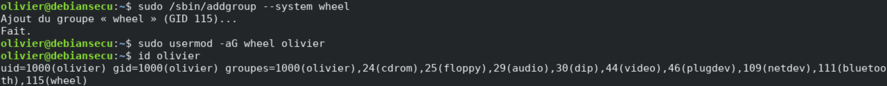

Bloquons ensuite l'accès au compte root aux membres du groupe _wheel_ :

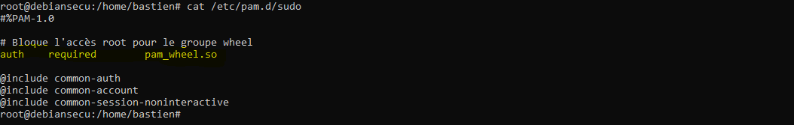

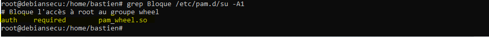

Pour que ce mécanisme fonctionne, il est impératif d'ajouter les superutilisateurs (membres du groupe _sudo_) au groupe _wheel_.

Désactivons enfin le shell de l'utilisateur root :

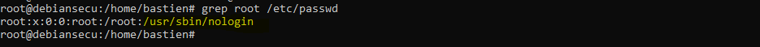

### Contres mesures contre le bruteforce

Limitons le nombre de tentative d'authentification :

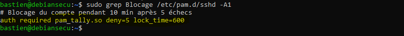

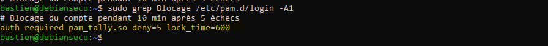

Le choix de bloquer pendant **10 minutes** au bout de **5 authentifications échouées** nous semble être un bon compromis entre le fait d'éviter de bloquer un utilisateur qui se serait trompé de mots de passe, et une réelle attaque par Bruteforce.

### Politiques de complexité des mots de passe

Définissons une politique de password pour forcer les utilisateurs à respecter les bonnes pratiques de sécurité.

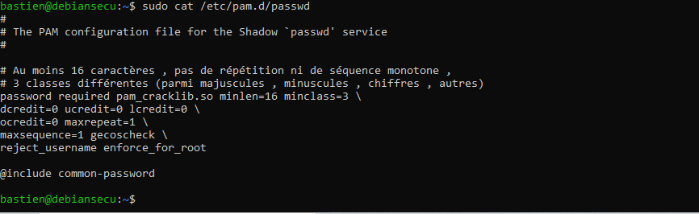

Dans cette politique, on demande à avoir au moins 16 caractères dans le mot de passe, et qu'il contienne au moins un mélange de chiffres, de lettres et de majuscules. Cette politique est cohérente avec les recommandations de l'ANSSI. Nous ne souhaitons pas forcer l'usage de caractères spéciaux, puisqu'ils peuvent être sujet à erreur en fonctions des claviers ou des encodages utilisés.

Testons cette politique :

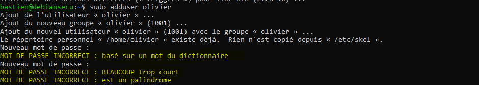

Définissons enfin une politique de stockage des mots de passe forte :

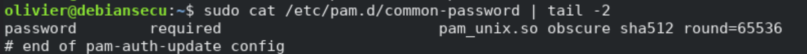

Avec un nombre de _round_ particulièrement haut et l'usage de sha512, les mots de passe stockés ne devraient pas être sujet à du Brutefoce sur les empreintes.

### Double authentification

Une bonne pratique est également de mettre en place la double authentification, pour éviter le cas où un attaquant pourrait se connecter directement à la machine s'il connaissait le mot de passe de l'utilisateur. Cela ajoute une couche de sécurité supplémentaire et non négligeable.

Utilisons Google authentificator pour implémenter de la double authentification dans le PAM de notre système Linux. On commence par installer la librairie qui va bien :

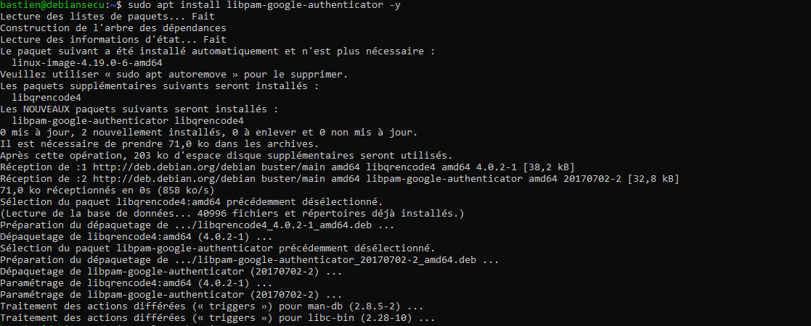

Puis on exécute google-authenticator pour générer un token :

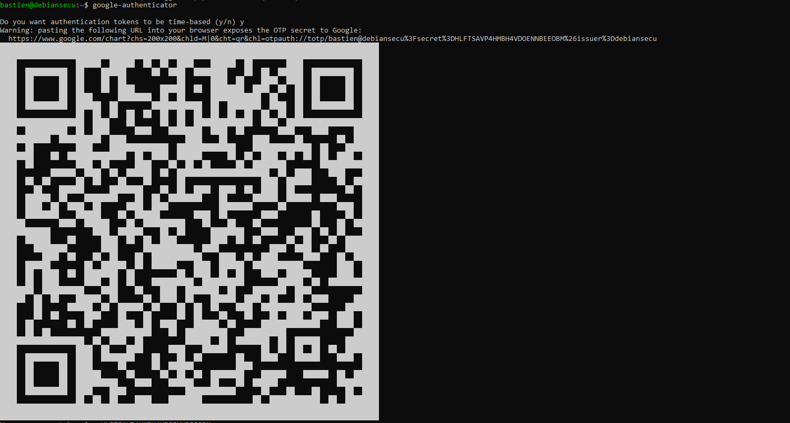

Configurons PAM et sshd pour qu'ils utilisent Google authentificator :

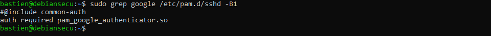

Et dans /etc/ssh/sshd-config

Puis vérifions que le mécanisme est fonctionel :

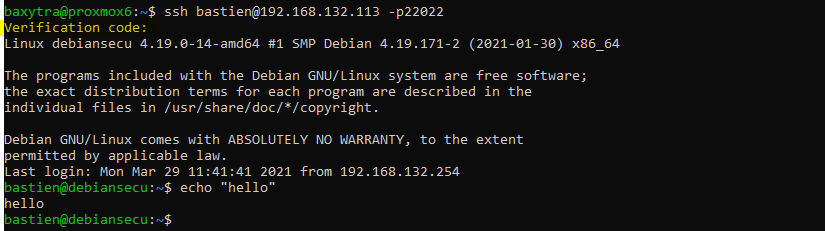

## Commentaires
