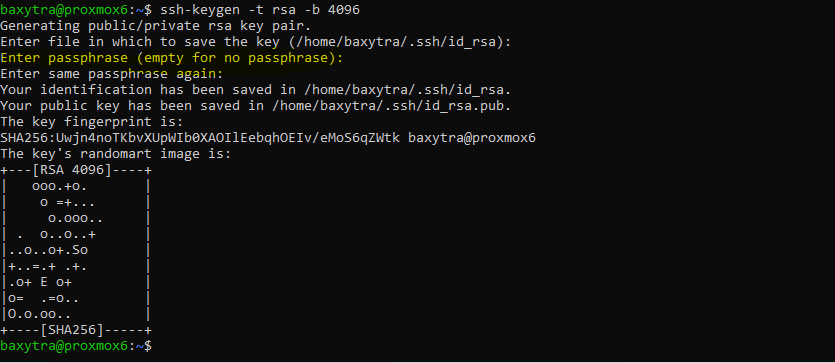
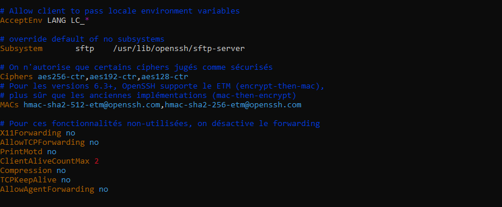

# Hardening de OpenSSH

Le service OpenSSH est le point d'entrée principal de notre système Linux. Il est donc primordial de durcir ce service.

## Classification

* Niveau ANSSI : intermédiaire
* Authentification
* Accès à distance

## Sources

* [ANSSI](https://www.ssi.gouv.fr/uploads/2016/01/linux_configuration-fr-v1.2.pdf)
* [LeCrabeInfo](https://lecrabeinfo.net/se-connecter-en-ssh-par-echange-de-cles-ssh.html)

## Procédures

### Authentification avec clé SSH

L'authentification s'effectuera désormais avec une clé SSH :

### Configuration de sshd

La configuration du service ssh est également durcie :

* le port d'écoute du service a été modifié (le parefeu local a été modifié en conséquence)
* l'authentification en tant qu'utilisateur root a été interdite
* l'authentification par mot de passe a été interdite
* les mécanismes de chiffrement utilisées sont robustes

## Commentaires