# Procédure d'installation

## Classification

* Principes : Minimisation
* Installation
* Chiffrement de disque

## Sources

* [ANSSI](https://www.ssi.gouv.fr/uploads/2016/01/linux_configuration-fr-v1.2.pdf)
* [Debian Administrator Handbook](https://www.debian.org/doc/manuals/debian-handbook/)
* Moodle

## Procédures

Définissons un motde passe robuste pour l'utilisateur root

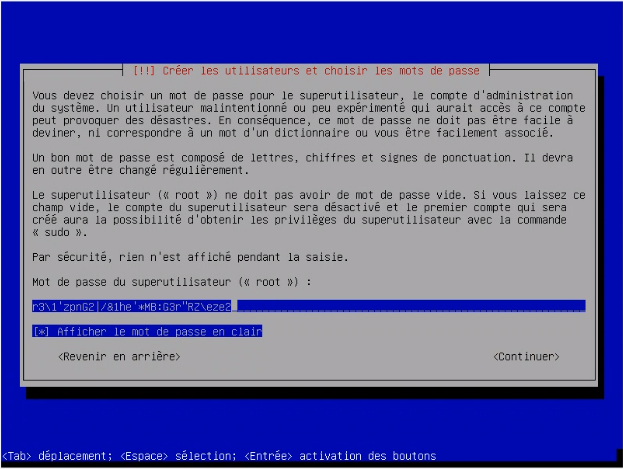

Créons ensuite un utilisateur nommé olivier :

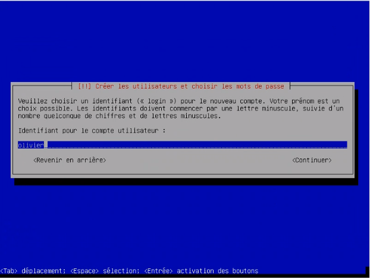

Choisissons de stocker nos données dans des LVM chiffrés :

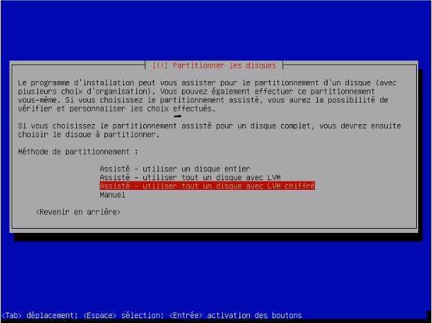

D'après les directives que nous avons reçus, nous ne créons qu'une seule partition

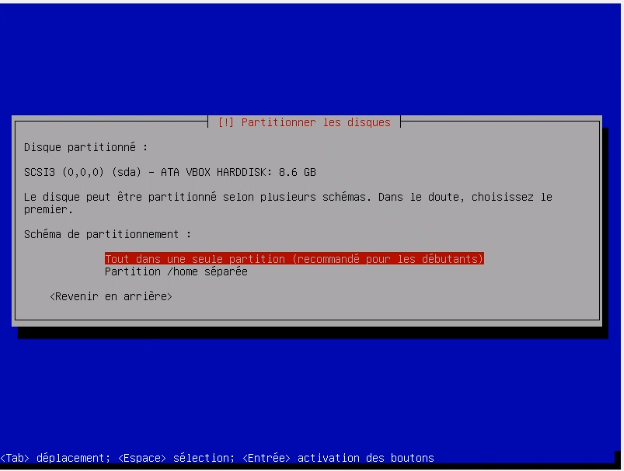

Définissons un mot de passe robuste pour le chiffrement des LVM :

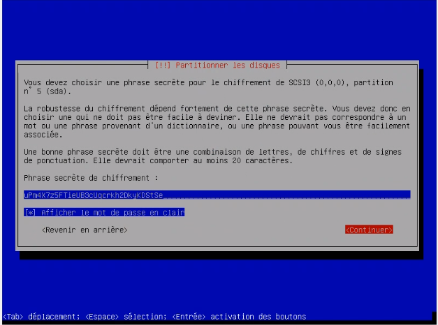

Fixons la taille maximale pour notre unique partition :

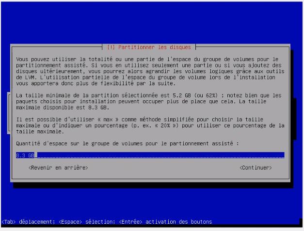

On choisit d’utiliser les 8Go pour la partition root, et de n’affecter aucun SWAP. En effet, la machine virtuelle créée possède 4Go RAM, ce qui ne sera jamais dépassé pour notre utilisation.

Voici le résumé du partitionnement :

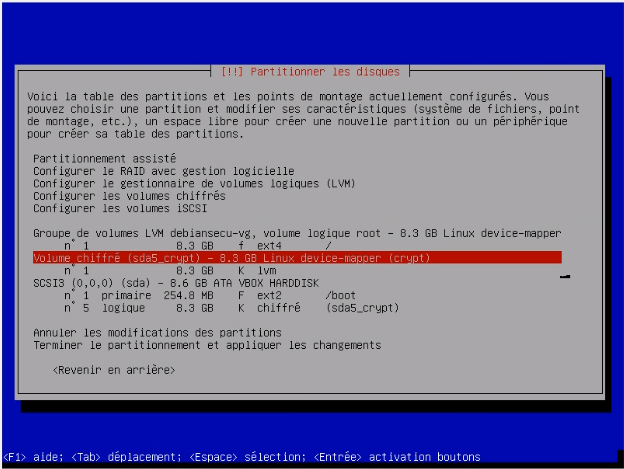

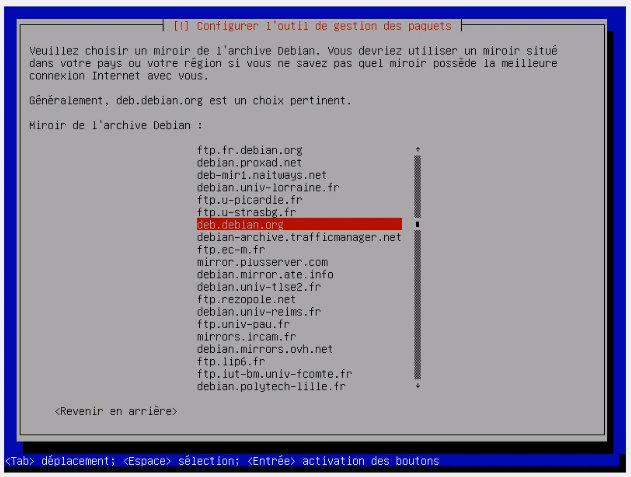

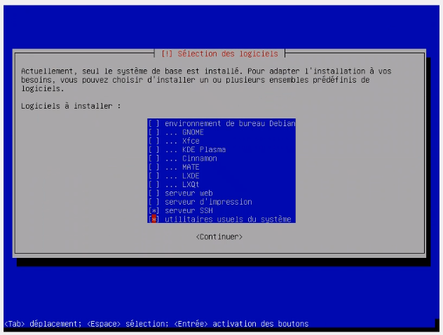

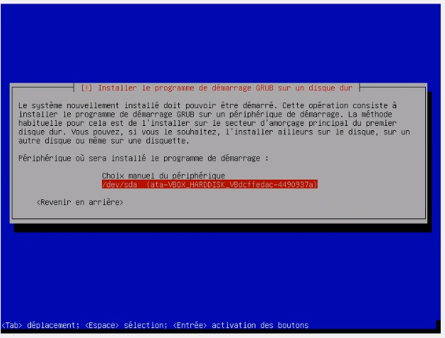

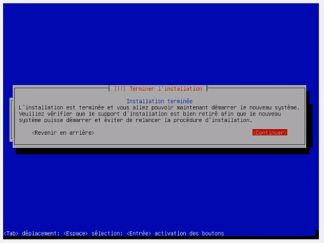

## Commentaires
