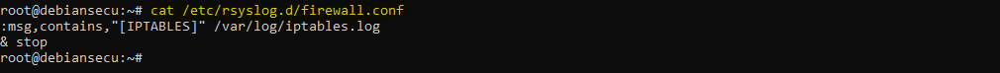
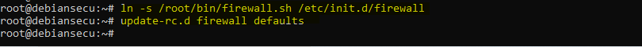
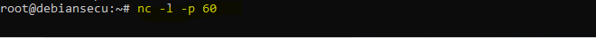
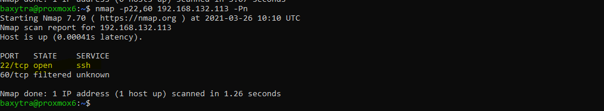

# Parefeu local

-classification (niveau ANSSI,type de mesure,  ...)
    -sources
    -procédures
    -commentaires (résultat, mesure écartée, conservée, adaptée,...)

## Classification

* Niveau ANSSI : intermédiaire
* Gestion des flux

## Sources

* [ANSSI](https://www.ssi.gouv.fr/uploads/2016/01/linux_configuration-fr-v1.2.pdf)

## Procédures

Voici une première version du script iptables que nous allons appliquer sur le serveur. Ses caractéristiques sont :

* Les flux entrants sont **bloqués** par défaut
* Les flux sortants sont **autorisés** par défaut
* Les flux entrants sur le port SSH sont **autorisés**
* Les nouvelles connexions SSH sont **journalisées**

On restreint les droits sur ce script :

On redirige les journaux généré par le parefeu vers le fichier _/var/log/iptables.log_ :

### Mise en place du parefeu local

Appliquons maintenant les politiques définies dans le script :

Faisons en sorte que ces politiques soient persitantes :

### Test du parefeu local

Testons nos politiques de parefeu :

## Commentaires