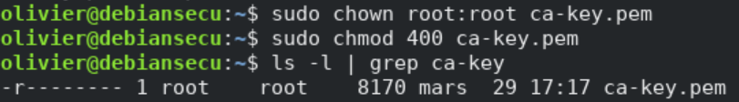
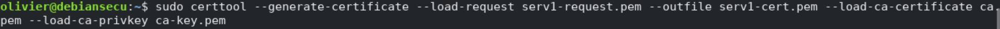
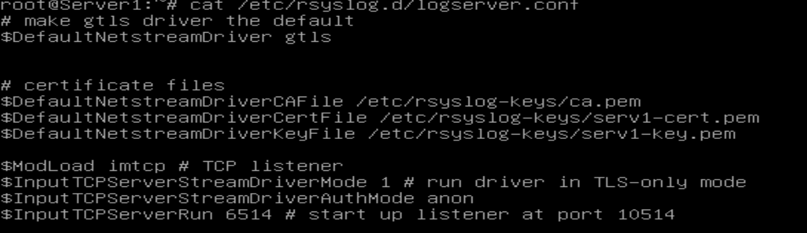
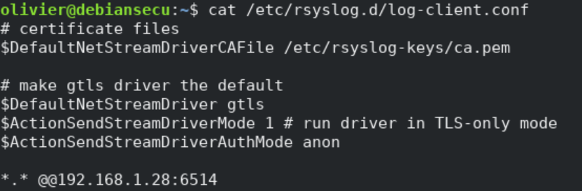

# Rsyslog

## Classification

* Niveau ANSSI : renforcé
* Principes : Défense en profondeur, Veille et maintenance
* Journalisation

## Sources

* [ANSSI](https://www.ssi.gouv.fr/uploads/2016/01/linux_configuration-fr-v1.2.pdf)
* [golinuxcloud.com](https://www.golinuxcloud.com/secure-remote-logging-rsyslog-tls-certificate/)

## Procédures

Nous allons nous intéresser ici aux étapes de configuration de la journalisation sécurisée avec rsyslog sur un serveur de journalisation distant à l'aide de certificats TLS. 
Ce document décrit donc un moyen sécurisé de configurer rsyslog (certificats TLS) pour transférer les journaux vers le serveur de journaux distant. 
Le simple chiffrement du canal de transmission n'est pas suffisant pour un environnement de journalisation sécurisé. Cependnat, voici quelques-uns des avantages de cette solution :
* les messages syslog sont chiffrés lors de leurs déplacements sur le fil
* l'expéditeur syslog s'authentifie auprès du serveur syslog; ainsi, ce dernier sait qui est l'expéditeur des logs.
* le serveur syslog s'authentifie auprès de l'expéditeur syslog; ainsi, l'expéditeur peut vérifier s'il envoie bien au destinataire attendu
* l'authentification mutuelle empêche en grande partie les attaques man-in-the-middle

### Génération des clés

Pour créer un certificat auto-signé afin d'obtenir une transmission sécurisée de syslog vers un serveur de journalisation distant, nous utiliserons certtool.
Dans cette étape, nous générons des certificats pour chacune des machines, les clients et les serveurs ayant besoin de certificats. Le certificat identifie chaque machine auprès du pair distant.

Générons la clé privée pour le client.

Cette clé a besoin des autorisations appropriées pour la rendre lisible par l'utilisateur root uniquement

Puis, nous faisons de même pour le serveur.

Générons ensuite une requête de certificat pour le serveur :

On crée maintenant le certificat CA (auto-signé) lui-même. Cette commande interroge sur un certain nombre de choses. Il est nnécessaire de donner les réponses appropriées. En ce qui concerne la validité des certificats, gardez à l'esprit que vous devez recréer tous les certificats lorsque celui-ci expire. Il faut donc trouver le bon compromis en durée entre sécurité et praticité

Personne, à l'exception de l'autorité de certification elle-même, n'en a besoin. Si un tiers l'obtient, votre sécurité est brisée !

Enfin, nous générons un certificat signé avec la clé du client pour le serveur :

Ensuite, nous devons copier ces clés (certificats) sur notre nœud distant. Pour cela, nous pouvons utiliser `scp`.

### Configuration du serveur

Nous devons maintenant faire quelques changements de configuration sur notre serveur de journalisation distant pour recevoir des messages de notre client via TCP en utilisant des certificats TLS.

Tout d'abord on va modifier le fichier `/etc/rsyslog.conf` en rajoutant les lignes suivantes :

Le premier élément permet de limiter les clients envoyant des logs à notre seul node.
Ensuite, les deux lignes suivantes nous permettent de stocker les logs dans un dossier spécifique pour chaque host envoyant des logs, afin de les séparer des logs propres au serveur.

Ensuite, on crée un nouveau fichier `/etc/rsyslog.d/logserver.conf` dont voici le contenu.

Ensuite, il est nécessaire d'installer le module `rsyslog-gnutls`. Puisque nous utilisons le pilote GTLS, ce module doit être installé à la fois sur le nœud client et serveur. Puis, on redémarre ensuite le service rsyslog.

Donc, notre configuration côté serveur est terminée, passons du côté client pour terminer notre journalisation à distance sécurisée.

### Configuration du client

Maintenant, configurons notre client pour transférer les journaux en toute sécurité vers notre serveur de journaux distant.

Pour cela, après avoir installé le module `rsyslog-gnutls`, nous allons créer un nouveau fichier à l'intérieur `/etc/rsyslog.d` dont voici le contenu.

Cela transmettra chaque message syslog à votre serveur de journalisation distant.

Nous avons tous terminé, il suffit maintenant de redémarrer le service rsyslog et vérifiez l'état.

### Vérification

Maintenant, nous allons essayer d'envoyer un message factice de notre serveur à notre client et vérifier notre configuration.

On vérifie maintenant le syslog sur le serveur.

Et nous avons reçu le message comme prévu, donc tout semble fonctionner correctement.

## Commentaires
Cette solution nécessitant l'utilisation de TCP et un chiffrement via TLS, son coût est beaucoup plus élevé qu'un simple envoie de logs via UDP. 
Par conséquent, si le volume de log est trop important, ce système ne pourra sans doute pas être appliqué dû à son débit fortement réduit comparé à d'autres moyens.
